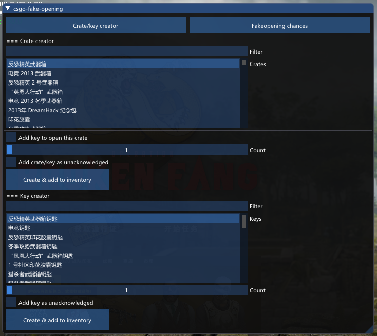
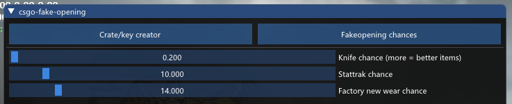

# 展示柜

# csgo-fake-opening
csgo-fake-opening 允许无限制的打开 武器箱/胶囊，所有的物品都在本地使用，因此您的库存中不会有该物品。

- 打开任何您想要的 武器箱/胶囊
- 支持赛事武器箱
- 修改获得物品的几率
- 在游戏内使用 <a href="https://github.com/ocornut/imgui">ImGui</a> 配置

# 使用方法
- 用以下命令克隆源代码: git clone --recursive https://github.com/H-xiaoH/csgo-fake-opening.git
- 使用您喜欢的编译器进行编译
- 将生成的库注入游戏
- 按 <kbd>Insert</kbd> 打开菜单
- 创建您想打开的 武器箱/钥匙
- 开箱!

# 许可
<b>该项目已获得 MIT 许可</b>

有关更多详细信息，请参见 "<a href="https://github.com/H-xiaoH/csgo-fake-opening/blob/master/LICENSE">LICENSE</a>" 文件。
